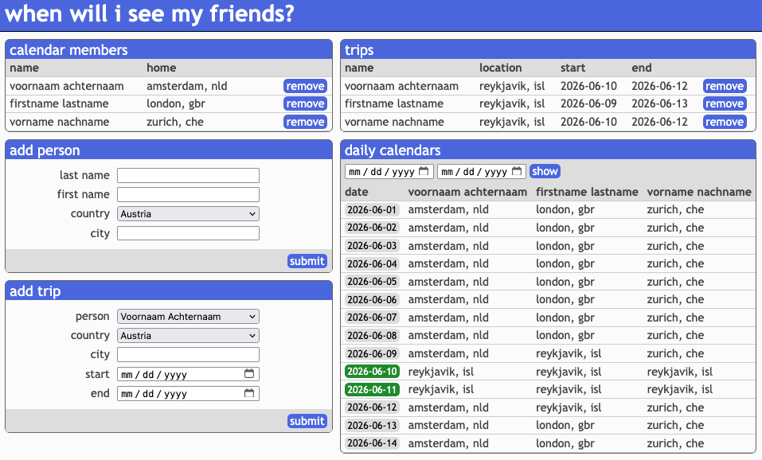

# calendar

## Overview

A website to track calendars, as a learning exercise.
- Creates a website with a simple database that stores people, their home locations, and any trips they have scheduled.
- Add friends and where they live.
- Add any trips they will go on (e.g., London from 1-5 June 2026).
- The website displays where everyone is on each day and when everyone will next be together, in the same place.

## Technical details

- The entry point is `main.py`. This fires up the app and connects to the database.
- Structured as a python package in `schedules` directory.
- Currently hosted on GCP with a Neon DB for the database.
